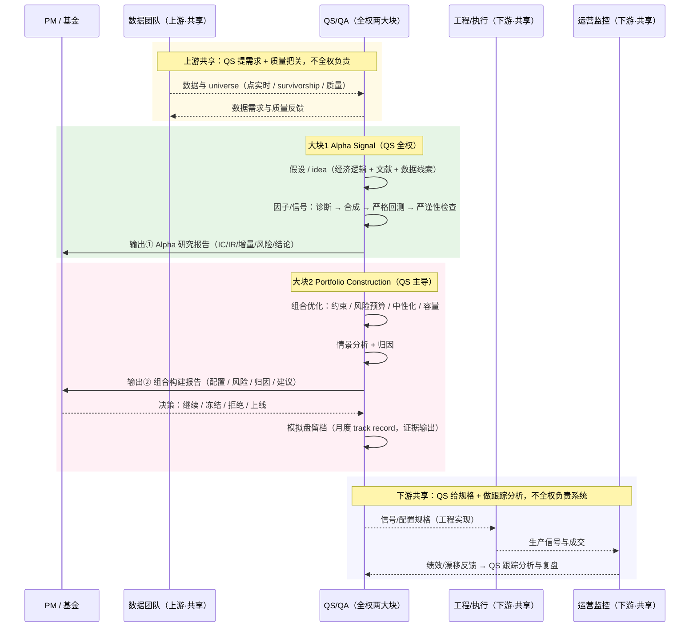

# QS/QA 工作流时序图（两大核心块版）· 项目保留与整合判定

> 核心认知（用户确认 + JD 验证）：
> - **QS/QA 全权负责两大块：① Alpha Signal 研究 ② Portfolio Construction**
> - 两大块都输出给 PM（研究报告 / 组合报告 / 决策 memo）
> - **数据与落地监控是上下游共享**：数据团队上游、工程/运营下游，QS 不全权负责，但要做质量把关和跟踪分析
> 依据：Millennium / Point72 / Qube / Nomura JD 职责（2026-08 检索）+ quant-jd-research 训练样本
> 版本：2026-08-31

## 1. 优化后时序图（两大核心块 + 上下游共享）



---

## 2. 两大块对应的项目：保留 / 整合 / 新建

| 归属 | 现有项目 | 处置 | 理由 |
| --- | --- | --- | --- |
| 大块1 Alpha Signal | **QS工作台**（qs-alpha-research-workbench） | ✅ **保留并升级**（核心旗舰） | 因子库 → 诊断 → 合成 → 回测 → 归因 → 简报，正是大块1 全流程 |
| 大块1 | C LLM 另类数据 | 🔗 **整合**并入 QS工作台案例区 | 它是"另类数据 → 信号"的一个应用案例，不是独立引擎；并入后作品集更聚焦 |
| 大块1 | 量化项目精选（04 横截面 / 02 动量低波 / 12-1 动量） | 🔗 **整合**为 QS工作台 cases/ | 同属信号研究案例，避免仓库碎片化 |
| 大块1（上游） | 数据底座（待建） | 🔗 **整合**为 QS工作台 data 模块 | 数据是上游共享，做成模块 + 文档即可，不单独建仓 |
| 大块2 Portfolio Construction | **A 组合优化**（portfolio-optimization） | ✅ **保留并升级**（核心旗舰） | 组合构建与优化全流程；补容量 / 情景分析后即完整 |
| 大块2 | B 多资产配置 | 🔗 **整合**并入 A（portfolio-lab）作为多资产案例 | 配置 = 信号到权重的组合决策，并入组合块最顺；对口多资产岗位的旗舰案例 |
| 证据输出（QS 侧） | — | 🆕 **新建 paper-track 引擎** | 模拟盘月度 IC/IR/回撤/换手/净收益 vs 基线 + 监控指标 + 复盘日志；对应 JD "Monitor signal behaviour and model performance over time" |
| 作品集索引 | quant-portfolio-writeups | ✅ 保留 | 总览 README 串联两大块 + 证据仓，方便面试官 3 分钟看懂 |
| 能力库 | ML / 深度学习 / 时间序列 | ✅ 保持 private 笔记 | 支撑技能，不进作品集 |

---

## 3. 推荐的最终仓库结构（全部 private）

```
quant-portfolio-writeups（索引：README 总览）
├── qs-alpha-research-workbench   ← 大块1 Alpha Signal（旗舰）
│     ├── alpha_research/        因子库/诊断/合成/回测/归因/简报
│     ├── rigor/                 严谨性：deflated SR / purged CV（升级项）
│     ├── data/                  universe / survivorship / 质量校验（整合项）
│     └── cases/                 C 另类数据、04 横截面、02 动量低波（整合项）
├── portfolio-optimization        ← 大块2 Portfolio Construction（旗舰）
│     ├── portfolio/             约束优化/风险预算/中性化/容量（升级项）
│     ├── scenarios/             情景分析 + 归因（升级项）
│     └── multi_asset/           B/B+ 多资产配置案例（整合项）
└── paper-track-record            ← 证据输出（新建 P0）
      ├── monthly/               月度模拟盘记录（防 cherry-pick）
      ├── metrics/               IC/IR/回撤/换手/成本后净收益 vs 基线
      └── review/                季度复盘 + 研究日志
```

---

## 4. 结论与行动顺序

1. **大块1、大块2 是作品集的两根支柱**：QS工作台（α-lab）和 A 组合优化（portfolio-lab）保留并升级；B、C、量化项目精选全部**整合**进去当案例，不各自占仓。
2. **数据与落地监控不单独建仓**：数据做成 QS工作台里的模块（上游共享定位）；监控并入 paper-track 作为证据留档（下游共享定位）。
3. **唯一需要新建的是 paper-track 引擎（P0）**——按月积累，是买方最认的连续证据。
4. 仓库从 7 个收敛到 4 个作品集仓（索引 + 两大块 + 证据），能力库 3 个保持 private。

---
*依据：Millennium/Point72/Qube/Nomura JD（2026-08）｜ quant-jd-research 训练样本｜ 本文件 2026-08-31*
