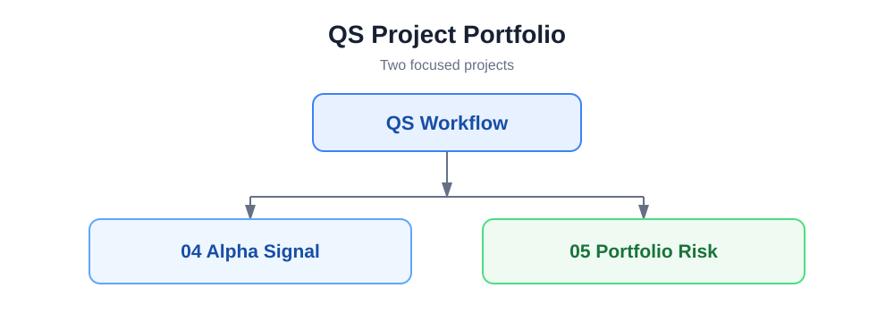
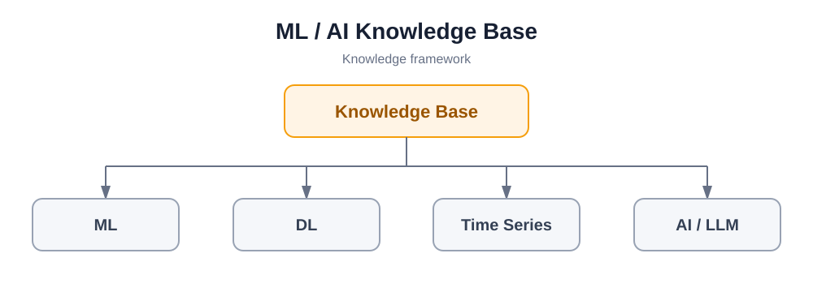
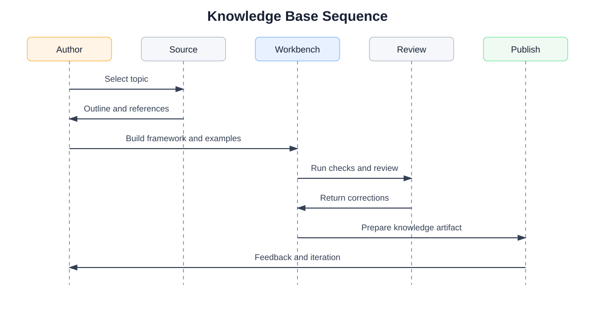

# Quant Research Portfolio

> 一个统一的研究工作流框架，分为两个部分：QS 项目集，以及 ML / AI 知识库集。

[进入 QS 项目集](#1-qs-project-portfolio) · [进入 ML / AI 知识库](#2-ml-ai-knowledge-base)

## 总体结构

## 1. QS Project Portfolio

基于 QS 工作流时序图，项目集只聚焦两个项目：

- **04 Alpha Signal**
- **05 Portfolio Risk**

### 项目框架图

### QS 工作流时序图

[查看 QS 项目框架与时序图](./QS_QA_%E5%B7%A5%E4%BD%9C%E6%B5%81%E6%97%B6%E5%BA%8F%E5%9B%BE_%E5%BA%94%E6%9C%89%E9%A1%B9%E7%9B%AE%E6%B8%85%E5%8D%95.md)

## 2. ML / AI Knowledge Base

知识库集只保留学习框架和知识产出流程，不在这里展开具体 Notebook 或课程内容。

### 知识库框架图

### 知识库产出时序图

ML / AI 框架与时序图已整合在本项目首页。

---

这个仓库的入口只负责展示两部分的关系、框架图和时序图；具体项目代码与知识库内容保持在各自目录或仓库中。
